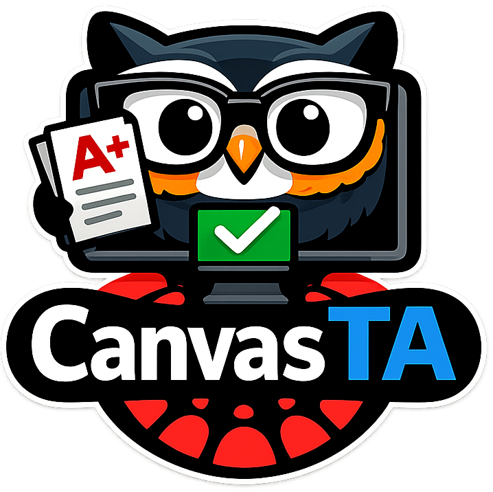
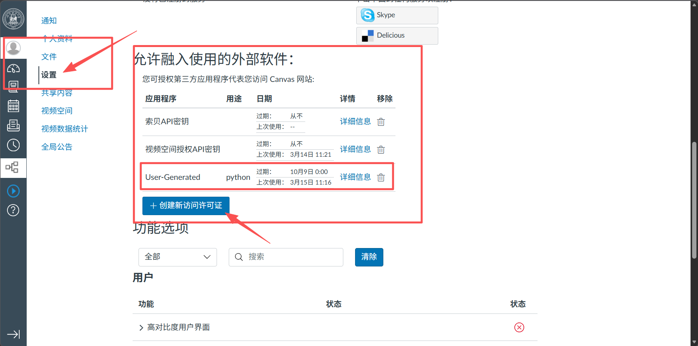

<p align="center">
  
</p>

<h1 align="center">CanvasTA</h1>

<p align="center">Multimodal LLM-based automation for Canvas assignment grading, human review, and feedback publishing</p>

<p align="center">
  English | <a href="./README.zh-CN.md">简体中文</a>
</p>

<p align="center">
  
  
  
  
</p>

---

## Overview

CanvasTA is designed to shorten repetitive grading workflows for instructors:

- Automatically fetch student submission attachments
- Extract text (PDF/docx/txt) and visual content (scanned files/images)
- Grade automatically and output structured JSON
- Let instructors review, edit score/comments, and mark review status in UI
- Publish only approved results back to Canvas

> The UI supports an end-to-end flow: Grade -> Review -> Submit.

---

## Quick Start (Recommended)

### 1. Install dependencies

```powershell
pip install -r requirements.txt
```

### 2. Initialize configuration

```powershell
copy .env.example .env
```

> Important: the program reads `.env` only, not `.env.example` automatically.  
> If you edit `.env.example` but do not copy/rename it to `.env`, your configuration will not take effect.

On macOS/Linux:

```bash
cp .env.example .env
```

Then fill in these minimum required values:

- `CANVAS_TOKEN`
- `COURSE_ID`
- `ASSIGNMENT_ID`
- `LLM_API_KEY`

---

## How to Get a Canvas Token

Follow this guide image to generate your Canvas token:




### 3. Start the UI

```powershell
python run_canvas_ta.py review
```

In the UI:

- Click `1) Fetch & Grade Assignments` in the sidebar
- Review each student result and save changes
- Click `2) Submit All Approved Results` (or submit one by one)

---

## API Configuration (Most Common Scenarios)

To reduce setup complexity, the project supports the following modes (resolved by priority):

### Mode A: OpenAI / Compatible Gateway (Recommended)

Works with OpenAI, OpenRouter, OneAPI, and most compatible gateways.

```env
LLM_PROVIDER=auto
LLM_API_KEY=your_key
LLM_BASE_URL=https://api.openai.com/v1
```

Notes:

- Usually, `LLM_API_KEY` + `LLM_BASE_URL` is enough
- The client auto-appends the `chat/completions` path
- If your provider gives a full endpoint URL, use Mode B

### Mode B: Full Endpoint URL

```env
LLM_API_KEY=your_key
LLM_API_URL=https://your-gateway/v1/chat/completions
```

Notes:

- If `LLM_API_URL` is provided, it will be used directly
- Useful for fixed routes or non-standard proxy paths

### Mode C: Azure OpenAI

```env
LLM_PROVIDER=azure
AZURE_OPENAI_ENDPOINT=https://your-resource.openai.azure.com
AZURE_OPENAI_API_KEY=your_azure_key
AZURE_OPENAI_API_VERSION=2024-06-01
```

Notes:

- Azure mode uses deployment-style URLs automatically
- `VISION_MODEL` / `GRADING_MODEL` should be deployment names in Azure mode

### Supported variable aliases

You can also use:

- `OPENAI_API_KEY`
- `OPENAI_BASE_URL`

These aliases are recognized automatically.

---

## Open Source Safety and Git Tips

The project already includes open-source-friendly defaults:

- `.env` is ignored to avoid leaking API keys
- `Results/` is ignored to avoid leaking student grades/comments
- `student_submissions/` is ignored to avoid uploading raw assignment files
- `测试文件/` is ignored to keep unrelated files out of the main branch

When preparing a public repository for the first time, run:

```powershell
git rm -r --cached .env Results student_submissions 测试文件
git add .gitignore .env.example
git commit -m "chore: prepare open-source safe defaults"
```

---

## Run Commands

Unified entrypoint:

```powershell
python run_canvas_ta.py grade   # 批改
python run_canvas_ta.py review  # 打开 UI（推荐）
python run_canvas_ta.py submit  # 提交已审核结果
```

Legacy entrypoints (still supported):

```powershell
python run_grading.py
python submit_results.py
streamlit run canvas_ta/review_ui.py
```

---

## Project Structure

- `canvas_ta/config.py`: configuration parsing (multi-provider support)
- `canvas_ta/llm_client.py`: model request client
- `canvas_ta/extractor.py`: text/vision extraction
- `canvas_ta/grader.py`: grading logic
- `canvas_ta/pipeline.py`: grading and submission pipeline
- `canvas_ta/review_ui.py`: Streamlit review workspace
- `Logo/`: project logo and Canvas token guide

---

## FAQ

1. API connection error during grading

- Check `LLM_API_KEY` in `.env` first
- If using a proxy, try a full `LLM_API_URL` endpoint
- For Azure, verify deployment names and API version

2. No student results shown in the UI

- Click `Fetch & Grade Assignments` in the sidebar
- Verify `COURSE_ID` and `ASSIGNMENT_ID`

3. Submission target not found when publishing

- Ensure the student has an actual submission in that assignment
- Ensure `student_name` can be matched to Canvas records

---

## License and Contribution

This project is licensed under Apache License 2.0. See `LICENSE` in the repository root.  

PRs and issues are welcome. Please review the configuration and safety sections before contributing to avoid exposing sensitive data.
